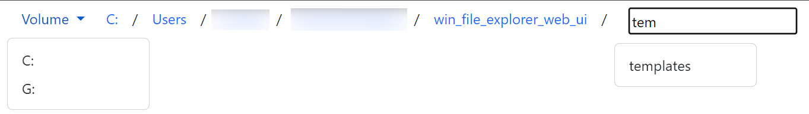

# Windows file explorer web UI

The template to select files in Flask web applications on Windows

Besides running on the server, Flask applications can also function as the graphic interface for Python applications. These applications are released as a whole software- they aren't separated as server and client. The web service is equivalent to GUI. Compared to GUI, it leverages the cross-platform feature of the web browser. When the program starts running, it provides service at a local port, and automatically pops up the web browser. Users interact with the software on the web page, instead of on a GUI window.

The price of the cross-platform feature is the security policy set by the web browser. For example, the software cannot access local file structures with pure Javascript script. Therefore, it uses a Python backend (i.e. Flask application) to access files. First, users provide the file path on the web page. Then, the software accesses files from the backend and displays their content on the web page.

Instead of letting users input the string of file path, this tool provides a more user-friendly file selector.

